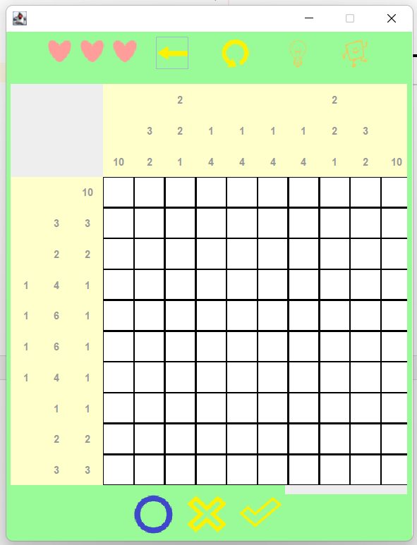

  

<h1>
NemoNemoLogic
</h1>

### 목차
    0. 실행환경
    1. Program 개요
    2. page 구성
    3. DB 구성도
    4. class 구조
 

### 실행환경

    Java : openJdk11
    DB : Oracle 11g
### 만든사람
   <table>   
   <tr><td>이름</td><td>깃허브</td>
   <tr><td>진웅휘</td><td><a href="https://github.com/woongwhee">@woongwhee</a></td></tr>
   <tr><td>김채영</td><td><a href="https://github.com/KCY9392">@KCY9392</a></td></tr>
   </table>
   
    
 

### 1. Program 개요
    지난 달 동안 배운 Java와 DB(Oracle)을 이용해서 만들 수 있는 프로그램을 생각해보던 중,
    DB에 저장할 내용이 있고, Java로 구현할 로직이 있는 프로그램이면서, 
    가볍게 구현 할 수 있는 프로그램이 뭐가 있을 까?
    고민하다 결정한 것이 네모 로직 게임입니다.
 

### 준비과정
    먼저 문제를 하나하나 제작 할 수 없기 때문에 네모로직에 관한 서비스를 제공하는 사이트에서 HTML을 파싱해와
    데이터 베이스에 저장했습니다.다. 그에 관한 폴더가 nemoScraping 입니다.
    파싱해오는것과 정답을 계산하는 과정은 다른 분들의 소스를 참조했습니다.

 

### 2. Page 구성
 
1. 프로그램 실행 시, 로그인을 실행합니다.
<pre>
   아이디 입력창이 MainMenu창 위로 나옵니다. 
     - 입력된 아이디가 없으면, DB에 입력한 아이디 정보를 새로 생성하고,
     - 입력된 아이디가 존재하면, 입력한 아이디의 정보를 내부적으로 호출합니다.
       
</pre>
 

2. 로그인 완료 후, MainMenu창을 실행합니다.
<pre>
   -> Game Start 버튼 , 이어하기 버튼 , 갤러리 버튼
       
</pre>
 

3. MainMenu 창에서 Game Start 버튼을 누르면,
<pre>
     - easy 선택 시, 문제정보 테이블에서 문제 id가 2000미만의 문제들을 전부 긁어와 페이지를 구성합니다.
     - nomal 선택 시, 문제정보 테이블에서 문제 id가 2000~3000사이의 문제들을 전부 긁어와 페이지를 구성합니다.
     - hard 선택 시, 문제정보 테이블에서 문제 id가 3000이상의 문제들을 전부 긁어와 페이지를 구성합니다.
       
</pre>
 

4. level(easy/normal/hard) 중 하나를 선택하면, 문제 리스트가 나옵니다.
<pre>
   - 첫 페이지일 경우, 이전버튼 (<-)을 비활성화하고, 
   - 마지막 페이지일 경우, 다음버튼 (->)을 비활성화합니다. 

   - unclear한 문제일 경우, ? 이미지로 나타나고,
    
   
   - clear한 문제일 경우, clear 이미지로 나타납니다.
   
</pre>
 

5. 문제를 하나 선택하면, playsite가 나옵니다.
<pre>
   - 생명(하트) 아이콘 3개 
   - 이전 버튼 : MainMenu창으로 돌아가기
   - 다시하기 버튼 
   - 힌트 버튼

   - O : 정답을 확신하고 푸는 용
   - X : O한것을 취소하는 용
   - 체크 : 정답인지 모호할때, 잠깐 적어두는 용
       
    
   - playsite에서 문제를 풀때, 칸을 누르면 색칠됩니다.
   
     
   ! 3번 틀릴 경우, "다시하시겠습니까?"라고 물어보는 창이 나옵니다.
   
</pre>

 

### 3. DB 구성
   Qestion_Data.sql파일에 테이블 정보를 저장해두었습니다.
   
   1. 사용자테이블Player.tb
<pre>
 용도 : 사용자의 아이디마다 (클리어 기록, 진행중인 게임 번호, 진행중인 게임 진행상황)을 저장하는 테이블입니다.
    
 - 로그인 시, 사용자의 정보를 가져오고, 
 - 게임 clear / 게임 종료 시, 진행상황이나 클리어기록을 갱신하도록 설계되어있습니다.
   <table>
   <tr>
      <td>PLAYER_CODE</td>
      <td>PLAYER_ID</td>
      <td>CLEAR_LIST</td>
      <td>CURRENT_QST</td>
      <td>CURRENT_DATA</td>
   </tr>
      <tr>
      <td>21</td>
      <td>admin</td>
      <td>1001,2002,3004,1002,</td>
      <td></td>
      <td></td>
      </tr>
         <tr></tr>
      <tr></tr>
     </table>
   
</pre>
    

2. 문제목록테이블 - QuestionInfo.tb
<pre>
 용도 : 난이도 별 문제 선택에서 필요한 건 문제에 대한 정보이고, 
        문제에서 필요한 정보는 해당 문제의 가로 세로 힌트와 정답 이기 때문에,
        QUESTIONINFO TABLE 과 QUESTION TABLE 을 분리시킵니다.

 - 난이도별 목차를 구성하거나 clear 목록을 구성하는데 사용됩니다.

 QST_ID : 문제 번호를 저장한다. 
 QST_NAME : 문제의 이름을 저장한다. 
 QST_SIZE:문제의 가로세로크기를 저장한다. 
 QST_LEVER:문제의 난이도를 저장한다.
<table>
      <tr>
      <td>QST_ID</td>
      <td>QST_NAME</td>
      <td>QST_SIZE</td>
      <td>QST_LEVEL</td>
      </tr>
      <tr>
         <td>1001</td>
         <td>사과</td>
         <td>5*5</td>
         <td>EASY</td>
      </tr>
      <tr>
         <td>2001</td>
         <td>포도</td>
         <td>10*10</td>
         <td>NOMAL</td>
      </tr>
</table>
    
</pre>
 

3. 문제정보테이블 - Question.tb
<pre>
 PlaySiteFrame을 구성하는데 필요한 데이터들을 저장합니다.
 문제 당 용량이 커서 따로 분리해놨습니다.

 - QST_CODE  : question info와 대칭되는 값, 정수로 저장되어있습니다.
 - ROW_HINT : 가로행 문제정보를 열단위로 세미콜론(;)을 통해 나누고 행단위로는 ","로 구분합니다.
 - COLUMN_HINT :가로행 문제정보를 행단위로 세미콜론(;)을 통해 나누고 열단위로는 ","로 구분합니다.
 - ANSWER : 정답을 1 빈칸을 0으로 저장하고, 행은 “,”단위로 구분합니다.
 
 문제코드의 시퀸스를 부여하여서
 -> easy난이도는 1000시작 / nomal난이도는 2000시작 / hard난이도는 3000시작 하도록 설정하였습니다.
    

<table>
    <tr>
      <td>QST_CODE</td>
      <td>Row_Hint</td>
      <td>Column_Hint</td>
      <td>ANSWER</td>
   </tr>
      <tr>
         <td>2001 </td>
         <td>10,10;8,8;6,6;5.....  </td>
         <td>10,10;8,8;6,6;5,1,5.... </td>
         <td>11100000000001111111111,1....... </td>
      </tr>
      <tr>
         <td>2002 </td>
         <td>10,10;8,8;6,6;5.....  </td>
         <td>10,10;8,8;6,6;5,1,5.... </td>
         <td>11100000000001111111111,1....... </td>
      </tr>
   
</table>
      </pre>
      
